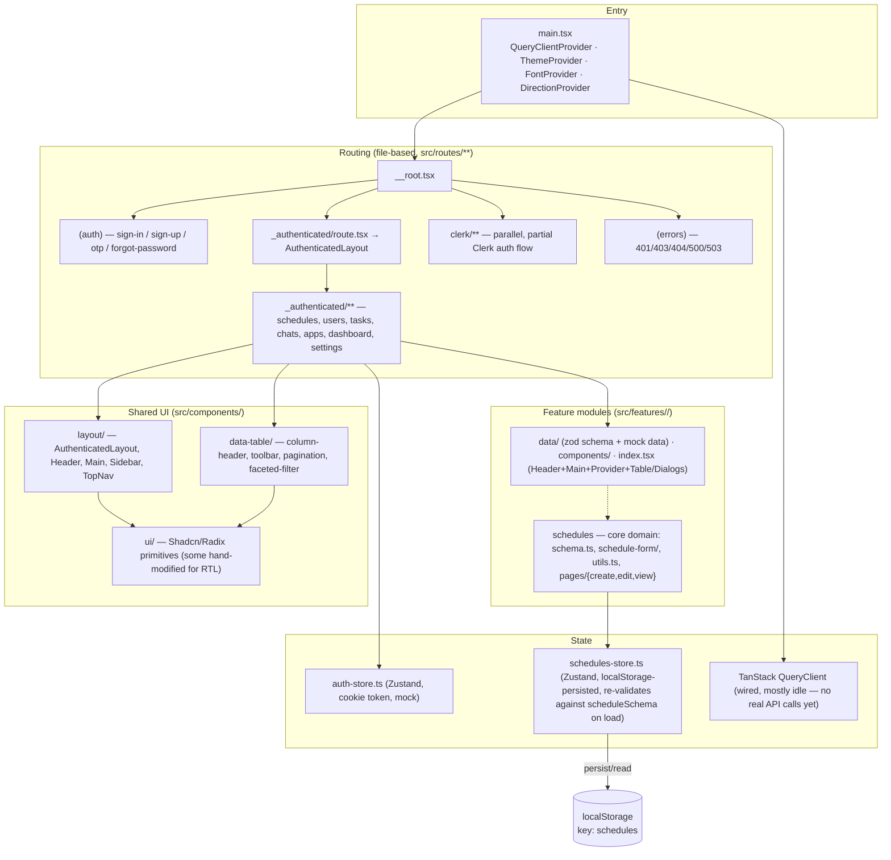
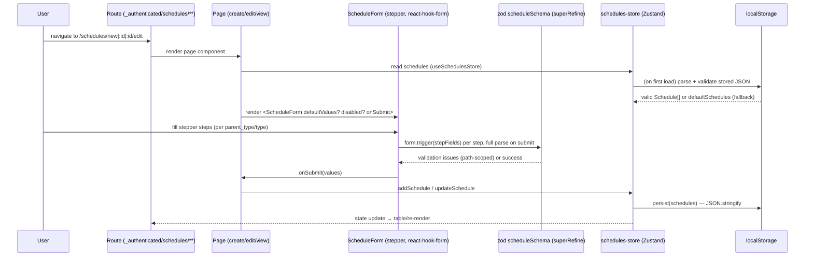

# Architecture

Living doc — current-state architecture of this repo. See also [TARGET_ARCHITECTURE.md](./TARGET_ARCHITECTURE.md) (where this is headed) and [FEATURE_MAPPING.md](./FEATURE_MAPPING.md) (feature → code map). Update this file when structure, routing, or state layers change materially; don't let it drift from the code.

## Stack

- **Build/dev**: Vite 8 + `@vitejs/plugin-react`, TypeScript (`tsc -b`), path alias `@/` → `src/`.
- **Routing**: TanStack Router, file-based via `@tanstack/router-plugin`. `src/routeTree.gen.ts` is generated — never hand-edit.
- **UI**: React 19, ShadcnUI primitives over Radix UI, Tailwind v4 (`@tailwindcss/vite`), RTL support via `DirectionProvider`.
- **Forms/validation**: `react-hook-form` + `@hookform/resolvers` + `zod` (schema-first validation, discriminated unions for variant types).
- **Client state**: Zustand (`src/stores`, per-feature `stores/`). `schedules` store persists to `localStorage`.
- **Server state (scaffolded, mostly unused today)**: TanStack Query, `QueryClient` created in `src/main.tsx` with global 401/500 handling.
- **Auth**: Two coexisting flows — the default mock auth (`src/stores/auth-store.ts`, cookie-backed fake token) used by `src/routes/_authenticated/**`, and a separate, partial Clerk-based flow under `src/routes/clerk/**`. They do not share state.
- **Testing**: Vitest, run headless in real Chromium via `@vitest/browser-playwright`. Tests are colocated as `*.test.ts(x)`.
- **Template origin**: This is the [shadcn-admin](https://github.com/satnaing/shadcn-admin) template with a custom `schedules` feature added on top; most of `src/features/*` other than `schedules` is template boilerplate (users, tasks, chats, apps, dashboard, settings) kept as reference/demo pages.

## Layered view

## Request/data flow — schedules (the real domain logic)

## Key architectural facts worth remembering

- **No backend**: `schedules` (and most other features) run entirely client-side against Zustand state; `schedules` additionally persists to `localStorage`. TanStack Query is configured (401/500 handling, retry policy) but not actually driving the schedules feature yet — see [TARGET_ARCHITECTURE.md](./TARGET_ARCHITECTURE.md).
- **Schema is the source of truth for validation**: `src/features/schedules/data/schema.ts` — a `zod` discriminated union on `parent_type` (`daily` → `weekly`/`weekly_one`/`monthly`; `regular` → shift-based with `superRefine` for cross-field rules). Read it before touching form validation.
- **Two auth systems coexist**: mock (`auth-store.ts`, used everywhere under `_authenticated`) and Clerk (`routes/clerk/**`, partial/incomplete). Don't assume Clerk is wired into the main app shell.
- **`routeTree.gen.ts` is generated** — edits get overwritten; change `src/routes/**` instead.
- **Hand-modified Shadcn primitives** exist under `src/components/ui/*` for RTL support — check the README's "Customized Components" list before re-running the shadcn CLI against those files.
